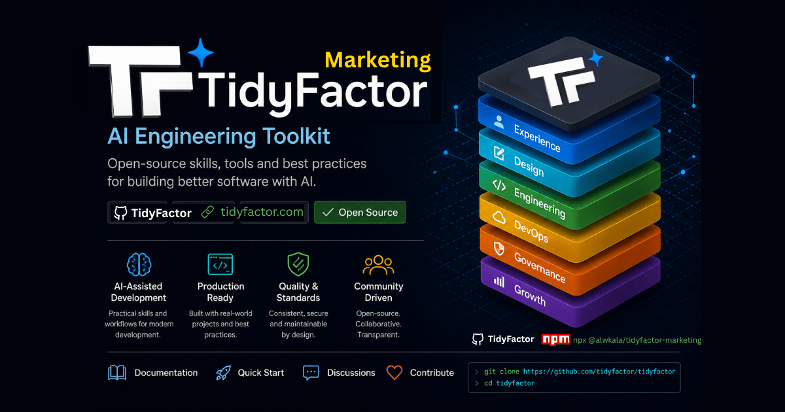

<div align="center">

# 🚀 TidyFactor Marketing `v1.3.0`
### AI Direct-Response Marketing, Contextual Decision Layer & Anti-Slop Content Suite

**The official marketing & customer acquisition foundation for the TidyFactor Ecosystem.**

[](https://www.npmjs.com/package/@tidyfactor/marketing)
[](LICENSE)
[](https://github.com/TidyFactor)
[](SKILL.md)
[](#-contextual-decision-layer-cdl)
[](README.ar.md)
[-green.svg?style=for-the-badge)](#-governance--quality-bar)
[](SKILL.md)

[ English ](README.md) • [ العربية ](README.ar.md) • [ فارسی ](README.fa.md) • [ Español ](README.es.md) • [ Português ](README.pt.md) • [ 简体中文 ](README.zh.md) • [ Deutsch ](README.de.md) • [ Français ](README.fr.md)

<br/><br/>

<p align="center">
  
</p>

</div>

---

> [!NOTE]
> **TidyFactor Marketing** is the AI direct-response marketing and growth track within the **TidyFactor Ecosystem**. It equips autonomous coding and growth agents (Google Antigravity, Claude Code, Cursor, Windsurf, Roo Code) and human growth marketers with deterministic, data-backed marketing playbooks across all 7 stages of customer acquisition, retention, and monetization.

---

## 🌟 Overview & Value Proposition

| For Founders & Marketers | For Product & Growth Leaders | For AI Coding & Growth Agents |
|---|---|---|
| **Zero Generic Fluff**: Banish vague advice ("post quality content"). Every output gives exact numbers, testable hooks, and execution timelines. | **Margin-Safe Monetization**: Built-in gross margin calculators prevent profit-destroying discounting and anchor 3-tier Good/Better/Best pricing. | **Token-Efficient Routing**: Modular slash commands load only the relevant workflow and memory file (~400 tokens) per prompt. |
| **Bilingual Direct Response**: Native Modern Standard Arabic (فصحى معاصرة رنانة) and English direct-response parity. | **Complete Funnel Coverage**: From T-30 product launch buzz to paid ads, SEO topic clusters, cart recovery, and 90-day win-backs. | **Strict Quality Guardrails**: Pre-emission validation checklists ensure every deliverable is actionable and verifiable. |
| **Regional MENA Mastery**: Country-specific platform penetration rankings and payment conversion data (Mada, Tabby, Tamara, InstaPay). | **Scientific Experimentation**: Prioritize tests using ICE scoring ($\text{Impact} \times \text{Confidence} \times \text{Ease}$) with testable hypotheses. | **Deterministic Outputs**: 100% architectural compliance across 7 commands, 7 workflows, and 7 operational memory modules. |

---

## 🏛️ Ecosystem Architecture

```
tidyfactor-marketing/
├── .tidyfactor                        ← Ecosystem JSON metadata manifest
├── brand.json                         ← Brand token defaults & voice principles (v2 schema)
├── AGENTS.md                          ← Workspace rules & agent execution routing
├── SKILL.md                           ← Master Command Dispatcher (28 Capabilities)
├── SKILL-REGISTRY.md                  ← Unified naming, CLI commands, and metadata
├── VISION.md                          ← Track summary aligned with TidyFactor Vision
├── CHANGELOG.md                       ← Semantic release notes (v1.2.0)
├── requirements.txt                   ← Python conversion & data analytics tooling
├── package.json                       ← NPM package config (@tidyfactor/marketing)
├── README.md & README.ar.md           ← Bilingual documentation
├── bin/                               ← CLI executables (create-kit.js, add-skill.js, remove-skill.js)
├── references/
│   ├── commands/                      ← 7 Intent-routed command dispatchers
│   ├── workflows/                     ← 7 Step-by-step outcome workflows with validation checklists
│   └── memory/                        ← 7 Operational memory modules (copywriting, metrics, specs, math)
├── .claude-skill/                     ← Claude Code & Cursor native wrapper
└── .agents/skills/tidyfactor-marketing/ ← Google Antigravity & Windsurf native wrapper
```

---

## 🧠 Contextual Decision Layer (CDL v1.0) & `/brief`

To prevent AI agents from generating disconnected or generic marketing campaigns, `tidyfactor-marketing` implements the **Contextual Decision Layer**:

1. **Pre-flight Discovery Interview (`/brief`)**: Executes a structured 3-question interview and caches project baselines into `.tidyfactor/marketing-brief.md`.
2. **Deterministic Boolean Skip Conditions**: Bypasses elicitation automatically if a brief exists, if parameters are declared in the prompt, or if direct commands are called.
3. **Single-Round Batching & Priority Hierarchy**: Batches unresolved ambiguities into at most 3 questions with strict priority:
   $$\mathbf{M1 \text{ (Market/Region)}} > \mathbf{M2 \text{ (Voice Archetype)}} > \mathbf{M3 \text{ (Funnel Stage)}} > \mathbf{M4 \text{ (Offer)}} > \mathbf{M5 \text{ (Depth)}}$$
4. **7-Axis Pre-Emit Self-Critique (`P/H/E/S/R/V/D`)**:
   `/* Pre-emit critique: P5 H5 E5 S5 R5 V5 D5 */`
   - **P (Pain Specificity)**: Solves acute customer friction with zero fluff (1-5).
   - **H (Hook Strength)**: 3-second visual and verbal curiosity hook (1-5).
   - **E (Execution Completeness)**: Full asset copy, CTAs, and friction reducers (1-5).
   - **S (Stage Fit)**: Matches Schwartz 5 Stages and regional vernacular (1-5).
   - **R (Restraint & Margin)**: Protects unit gross margin and brand equity (1-5).
   - **V (Voice Authenticity)**: Zero banned AI clichés or buzzwords (1-5).
   - **D (Decision Alignment)**: 100% compliant with the confirmed `.tidyfactor/marketing-brief.md` (1-5).

---

## ⚡ 8 Marketing Commands & 28-Capability Registry

Every capability is routed through a dedicated command file, executed via a single-outcome workflow, and informed by operational memory anchors:

| Pillar | Capability | Slash Command | Trigger Keywords | What It Loads | Output Deliverable |
|---|---|---|---|---|---|
| **1. Strategy** | **Brand Voice & Positioning** | `/marketing strategy` | "brand voice", "positioning statement", "هوية العلامة" | `campaign-launch.md` + `frameworks.md` | Canonical positioning statement, 3 contrast voice pillars, tone-flex map, competitive differentiator |
| **1. Strategy** | **Campaign Strategy** | `/marketing strategy` | "campaign strategy", "marketing plan", "خطة تسويق" | `campaign-launch.md` + `metrics-benchmarks.md` | Multi-channel strategy, audience segmentation, budget allocation, target KPI scorecard |
| **1. Strategy** | **Product Launch Plan** | `/marketing strategy` | "product launch", "launch plan", "إطلاق منتج" | `campaign-launch.md` + `frameworks.md` | Phased launch calendar (Pre-launch T-30, Blitz T-0, Momentum T+14), VIP waitlist funnel |
| **2. Content** | **Social Media Posts** | `/marketing content` | "social media content", "write posts", "محتوى سوشيال" | `content-engine.md` + `platform-specs.md` | 10+ platform-native post variations with 0-3s attention hooks, formatting rhythm, and CTAs |
| **2. Content** | **SEO Strategy & Topics** | `/marketing content` | "seo strategy", "keyword clustering", "استراتيجية السيو" | `content-engine.md` + `frameworks.md` | 3-Bucket Search Intent map, 3,000w Pillar Guide outline, 5 cluster long-tail post briefs |
| **2. Content** | **Content Calendar** | `/marketing content` | "content calendar", "publishing schedule", "جدول نشر" | `content-engine.md` + `platform-specs.md` | 30-day cross-platform publishing grid with pillar balance, format tags, and visual asset cues |
| **2. Content** | **Newsletter Strategy** | `/marketing content` | "newsletter strategy", "email newsletter", "نشرة بريدية" | `content-engine.md` + `frameworks.md` | High-open newsletter blueprint, 3 A/B test subject lines, Hook-Story-Offer deep dive layout |
| **3. Social Media** | **LinkedIn B2B Marketing** | `/marketing social` | "linkedin b2b", "founder personal brand", "لينكد إن" | `social-growth.md` + `platform-specs.md` | Founder thought-leadership strategy, 4 B2B content pillars, 3-touch outbound InMail etiquette |
| **3. Social Media** | **Instagram Growth** | `/marketing social` | "instagram strategy", "reels hooks", "إنستغرام" | `social-growth.md` + `platform-specs.md` | Bio conversion formula, pinned anchor highlights, 5 Reel video scripts, daily story sequences |
| **3. Social Media** | **TikTok Video Hooks** | `/marketing social` | "tiktok strategy", "short form video", "تيك توك" | `social-growth.md` + `platform-specs.md` | 5 short-form video scripts with 0-3s visual & verbal hook taxonomies, pacing directions, sound tips |
| **3. Social Media** | **Social Media Audit** | `/marketing social` | "social media audit", "profile teardown", "تدقيق حساب" | `social-growth.md` + `metrics-benchmarks.md` | Full profile diagnostic, engagement rate calculation, audience leak points, 30-day fix roadmap |
| **3. Social Media** | **First 1,000 Followers** | `/marketing social` | "first 1000 followers", "grow from zero", "أول 1000 متابع" | `social-growth.md` + `platform-specs.md` | $1.80 daily outbound value commenting strategy, peer collaboration flywheels, high-reach formats |
| **3. Social Media** | **Hashtag Strategy** | `/marketing social` | "hashtag strategy", "hashtags", "هاشتاجات" | `social-growth.md` + `platform-specs.md` | 3-Tier Hashtag Block (2 Broad + 4 Niche + 2 Micro/Branded), character & search keyword rules |
| **4. Email** | **List Growth Mechanics** | `/marketing email` | "grow email list", "lead magnet", "قائمة بريدية" | `email-lifecycle.md` + `frameworks.md` | High-converting lead magnet design (< 10min win), 2-step opt-in form copy, exit-intent triggers |
| **4. Email** | **Welcome Email Drip** | `/marketing email` | "welcome sequence", "onboarding drip", "رسائل ترحيبية" | `email-lifecycle.md` + `lifecycle-flows.md` | Complete 5-email sequence (Delivery, Origin Story, Myth Busting, Case Study, Urgency Offer) |
| **4. Email** | **Abandoned Cart Recovery**| `/marketing email` | "abandoned cart", "recover carts", "سلات متروكة" | `email-lifecycle.md` + `lifecycle-flows.md` | 3-stage recovery flow (1hr Support, 24hr Social Proof & FAQs, 48hr Expiring Incentive & Urgency) |
| **4. Email** | **Win-Back Sequences** | `/marketing email` | "win-back flow", "re-engagement", "استعادة العملاء" | `email-lifecycle.md` + `lifecycle-flows.md` | Time-boxed reactivation emails (30d Feature Update, 60d $20 Account Credit, 90d Permission Breakup) |
| **5. Advertising** | **Write Direct Ad Copy** | `/marketing ads` | "write ad copy", "meta ad copy", "كتابة إعلانات" | `paid-acquisition.md` + `ad-copy-templates.md` | 3 distinct psychological angles (Loss Aversion, Logic/ROI, Status), 15 Google RSA headlines |
| **5. Advertising** | **Landing Page & 7D CRO** | `/marketing ads` | "landing page strategy", "cro audit", "صفحة هبوط" | `paid-acquisition.md` + `metrics-benchmarks.md` | 8-section wireframe messaging hierarchy, 5-second clarity test, mobile 1-click checkout cues |
| **5. Advertising** | **Facebook / Meta Ads** | `/marketing ads` | "facebook ads", "meta ads plan", "إعلانات فيسبوك" | `paid-acquisition.md` + `metrics-benchmarks.md` | Advantage+ vs ABO structure, 72h creative testing budget ($20-$50/day), 20% scaling / kill rules |
| **5. Advertising** | **Google Ads Plan** | `/marketing ads` | "google ads plan", "search ads", "إعلانات جوجل" | `paid-acquisition.md` + `ad-copy-templates.md` | 15-Headline RSA matrix, search intent matching, 10-item negative keyword list |
| **5. Advertising** | **First Ad Campaign** | `/marketing ads` | "first ad campaign", "test budget", "أول حملة إعلانية" | `paid-acquisition.md` + `metrics-benchmarks.md` | $10-$20/day low-risk validation setup, Pixel/CAPI tracking verification, stop-loss benchmarks |
| **6. Promotions** | **Plan a Sale / Flash Sale**| `/marketing promo` | "plan a sale", "flash sale", "عروض وتخفيضات" | `promo-conversion.md` + `promotions-math.md` | 72-hour flash sale calendar (VIP Early Access, Mid-Sale Proof, Hard Close), urgency banners |
| **6. Promotions** | **Giveaways & Contests** | `/marketing promo` | "giveaway", "contest", "مسابقة" | `promo-conversion.md` + `promotions-math.md` | Niche-specific prize criteria, viral referral entry points (+5 entries/referral), consolation voucher |
| **6. Promotions** | **Pricing Strategy & Decoy**| `/marketing promo` | "pricing strategy", "pricing tiers", "تسعير وباقات" | `promo-conversion.md` + `frameworks.md` | 3-Tier Good/Better/Best table, Decoy Effect middle-tier anchoring, 15-20% annual discount model |
| **6. Promotions** | **Margin-Safe Coupons** | `/marketing promo` | "coupon strategy", "discount math", "كوبونات خصم" | `promo-conversion.md` + `promotions-math.md` | Required sales volume calculator, threshold AOV boosters ("Spend $100 Get $15"), dynamic expiry |
| **7. Growth** | **Retention & Churn Audit** | `/marketing growth` | "customer retention", "reduce churn", "تقليل الارتداد" | `viral-retention.md` + `lifecycle-flows.md` | Drop-off diagnosis by business model (SaaS onboarding, E-comm re-order), trigger check-in drips |
| **7. Growth** | **Loyalty Program Design** | `/marketing growth` | "loyalty program", "rewards program", "برنامج ولاء" | `viral-retention.md` + `metrics-benchmarks.md` | Model selection (Points for retail, Tiers for VIPs, Perks for SaaS), active participation KPI tracking |
| **7. Growth** | **2-Sided Referral Loops** | `/marketing growth` | "referral program", "viral loop", "برنامج إحالة" | `viral-retention.md` + `metrics-benchmarks.md` | Give $X / Get $Y incentive mechanics, post-purchase & NPS triggers, 3-tier milestone gamification |
| **7. Growth** | **Influencer Outreach** | `/marketing growth` | "influencer outreach", "influencers", "تسويق المؤثرين" | `viral-retention.md` + `metrics-benchmarks.md` | Engagement vetting scorecard (> 3%), personalized cold DM/email scripts, tracking UTM codes |
| **7. Growth** | **Brand Awareness Engine** | `/marketing growth` | "brand awareness", "pr outreach", "انتشار العلامة" | `viral-retention.md` + `frameworks.md` | Podcast/media pitching angles, co-marketing partnerships, 1-to-9 content repurposing flywheel |

---

## 🧠 The 12 Psychological Mental Models of Persuasion

TidyFactor Marketing systematically applies behavioral science across every copy generation and pricing tier:

| # | Mental Model | Psychological Mechanism | Implementation in TidyFactor Marketing |
|---|---|---|---|
| **1** | **Anchoring** | Human decisions rely heavily on the first price observed. | Displays original enterprise price crossed out before revealing the active tier. |
| **2** | **Decoy Effect** | An asymmetrical 3rd option makes the target tier irresistible. | Crafts a 3-tier structure where the middle Pro tier is clearly the highest-value option. |
| **3** | **Loss Aversion** | The pain of losing $100 is 2x stronger than gaining $100. | Emphasizes cost of inaction, wasted ad spend, and impending deadline consequences. |
| **4** | **Social Proof Stacking** | Humans look to peer consensus before taking financial action. | Combines client count ("10,000+ teams"), Trustpilot ratings, case study metrics, and quotes. |
| **5** | **Zeigarnik Effect** | People remember incomplete tasks and feel tension to finish. | Employs progress bars starting at 50% on multi-step onboarding and checkout forms. |
| **6** | **Goal Gradient** | Acceleration occurs as humans perceive closeness to the goal. | Formulates copy: "You are 1 click away from unlocking your personalized audit." |
| **7** | **Paradox of Choice** | Too many choices induces decision fatigue and zero conversion. | Enforces ONE primary CTA above the fold and exactly 3 clear pricing tiers. |
| **8** | **Framing Effect** | The cognitive frame determines subjective value. | Reframes discounts: "Save $1,200 every year" converts higher than "$100/mo off". |
| **9** | **Scarcity & Urgency** | Perceived value surges as supply or time restricts. | Implements 72-hour countdown timers, cohort seat limits, and expiring cart reserves. |
| **10** | **Sunk Cost Fallacy** | Commitment escalates once micro-investments are made. | Uses interactive calculators and quizzes before requesting email or credit card info. |
| **11** | **Halo Effect** | Credibility in one domain transfers to overall perception. | Embeds press mentions, SOC2 compliance badges, and partner certifications above the fold. |
| **12** | **Endowment Effect** | Valuation increases once a user feels psychological ownership. | Uses free sandbox playgrounds, interactive live previews, or 14-day free trials. |

---

## 🌍 MENA Regional Intelligence & Payment Infrastructure

Built-in operational parameters for GCC and North African markets:

```
├── 🇸🇦 Saudi Arabia (KSA) ── Priority: Snapchat → X → TikTok → Instagram → YouTube
│     ├── Key Payments: Mada (+35-50% CVR lift), Tamara, Tabby (+25-40% AOV lift), Apple Pay
│     └── Cultural Flags: High purchasing power, mobile-first visual content, local dialect respect
│
├── 🇦🇪 United Arab Emirates (UAE) ── Priority: Instagram → LinkedIn (B2B) → TikTok → YouTube
│     ├── Key Payments: Apple Pay, Stripe, Tabby, Tamara
│     └── Cultural Flags: International expat & local blend, mandatory English/Arabic parity
│
├── 🇪🇬 Egypt ── Priority: Facebook / Meta (#1 for B2C & B2B) → WhatsApp → YouTube → TikTok
│     ├── Key Payments: InstaPay, Fawry (+40% drop-off recovery), Meeza, Vodafone Cash, ValU
│     └── Cultural Flags: WhatsApp closing culture, high price/ROI consciousness, longevity proof
│
├── 🇰🇼 Kuwait ── Priority: Instagram → Snapchat → TikTok → WhatsApp
│     ├── Key Payments: KNET (Universal necessity), Apple Pay, Tamara, Tabby
│     └── Cultural Flags: Exceptionally high AOV, VIP concierge support expectations
│
└── 🇶🇦 Qatar, 🇯🇴 Jordan, 🇲🇦 Morocco ── Dedicated localized payment & trust matrices
```

---

## 🛡️ Anti-Cliché Governance & Quality Bar

Every sentence generated by **TidyFactor Marketing** must pass the **Mechanism Replacement Rule**:
> *If an adjective does not carry a verifiable number, a technical mechanism, or an empirical proof point, it is banned.*

### Forbidden Fluff & Mandatory Replacements:

| Banned Phrase (English) | Mandatory Mechanism Replacement |
|---|---|
| ❌ *"Cutting-edge / State-of-the-art"* | ✅ State the exact technology: `"Built on Next.js 16 with Postgres RLS"` |
| ❌ *"Seamless experience / integration"* | ✅ State the exact time/effort: `"Connects in 2 clicks with 0 code changes"` |
| ❌ *"Innovative / Customized solutions"* | ✅ State the custom capability: `"Custom multi-tenant auth module"` |
| ❌ *"Take your business to the next level"* | ✅ State the quantitative result: `"Increase checkout conversion rate by 25%"` |
| ❌ *"Quality you can trust"* | ✅ State the verification test: `"Tested under 5,000 concurrent requests"` |

| Banned Phrase (Arabic) | Mandatory Mechanism Replacement |
|---|---|
| ❌ *"نسعى دائماً لتقديم الأفضل / نحرص على التميز"* | ✅ اذكر الإجراء الفعلي: `"نختبر سرعة التحميل وتوافق الجوال قبل إطلاق أي صفحة"` |
| ❌ *"فريق من الخبراء المتخصصين"* | ✅ اذكر سابقة الأعمال بالأرقام: `"أكثر من 8 سنوات من إدارة حملات الـ B2B في الخليج"` |
| ❌ *"حلول متكاملة ومبتكرة"* | ✅ اذكر الميزة التقنية: `"منظومة ربط إلكتروني متكاملة مع بوابات مدى وتمارا"` |
| ❌ *"في عالمنا الرقمي المتسارع"* | ✅ احذف المقدمة الإنشائية وابدأ فوراً بالمشكلة والحل المباشر |
| ❌ *"الجودة هي شعارنا"* | ✅ اذكر الضمان الصريح: `"ضمان استرداد كامل للأموال خلال 30 يوماً بدون أي شروط"` |

---

## 🚀 Installation & Quick Start

Choose your preferred installation method:

### Option A: Via TidyFactor CLI (Recommended)
Install directly using the official ecosystem package runner into your active workspace:
```bash
npx @tidyfactor/cli add marketing
```
*Or if you have the CLI installed globally (`npm i -g @tidyfactor/cli`):*
```bash
tidyfactor add marketing
```

### Option B: Via Open Agent Skills Ecosystem (skills.sh / Vercel Labs)
Install using the universal multi-agent standard across all supported IDEs (Cursor, Antigravity, Claude Code, Windsurf, Trae, Codex):
```bash
npx skills add tidyfactor/marketing
```

### Option C: Standalone Zero-Dependency Runner (NPM Direct)
Run the dedicated skill installer directly with automatic cache invalidation:
```bash
npx @tidyfactor/marketing@latest
```

### Option 3: AI Agent Slash Commands (Claude, Antigravity, Cursor)
Trigger specialized growth workflows directly inside your agent chat:
```markdown
/marketing strategy  "Plan a phased launch for our new B2B SaaS in Saudi Arabia"
/marketing ads       "Write 3-angle Meta ad copy variations for an ergonomic office chair"
/marketing email     "Generate a 5-part welcome onboarding drip for our developer newsletter"
/marketing promo     "Design a 72-hour flash sale with margin protection and Tabby installments"
/marketing growth    "Diagnose churn drop-offs and design a 2-sided customer referral loop"
```

---

## 📊 Direct Response KPI Benchmarks

| Metric | E-Commerce (B2C) | B2B SaaS | Local Services | Info / Courses |
|---|---|---|---|---|
| **Meta CTR (Outbound)** | 1.50% - 2.80% | 0.80% - 1.60% | 1.20% - 2.50% | 1.80% - 3.20% |
| **Meta CPC** | $0.40 - $1.20 | $2.50 - $6.00 | $1.50 - $4.00 | $0.80 - $2.00 |
| **LinkedIn CPC** | N/A | $5.00 - $14.00 | N/A | $3.50 - $8.00 |
| **Google Search CTR** | 2.50% - 4.50% | 3.00% - 6.00% | 4.00% - 8.00% | 2.50% - 5.00% |
| **Landing Page CVR** | 2.00% - 4.50% | 3.00% - 8.00% (Lead) | 5.00% - 12.00% (Call) | 4.00% - 10.00% (Opt-in) |
| **Target ROAS (Blended)** | 2.8x - 4.5x | 1.5x - 2.5x (Front-end) | N/A (Pay-per-lead) | 3.0x - 5.0x |
| **Email Open Rate (Broadcast)** | 22% - 32% | 25% - 38% | 28% - 45% | 24% - 35% |
| **Welcome Drip Open Rate** | 50% - 70% | 55% - 75% | 60% - 80% | 50% - 68% |

---

## 📜 Architecture & Compliance

- **TidyFactor Skill Methodology**: Strict compliance with `spec.md` (6/6 rules passed).
- **Validation Tooling**: Run `python scratch/deep_audit_marketing_skill.py` to verify 0 broken links and 100% path resolution.
- **License**: Released under the open-source **[MIT License](LICENSE)** by **TidyFactor & [Alwkala](https://alwkala.com)**.


---

## 🏛️ TidyFactor Ecosystem Architecture

**TidyFactor** is a modular web architecture and AI coding agent skill ecosystem built on clear separation of concerns across the product lifecycle:

```
TidyFactor Organization (github.com/TidyFactor)
│
├── Design Skills
│   ├── Cinematic    → Experience / "Wow"     (Apple × Cartier Scroll-Driven Landing Pages)
│   ├── Design       → Prototype / "Build"    (Code-Native UI Design Engine & Figma Alternative)
│   └── Styler       → Production / "Ship"    (Framework Styler & RTL Polish Engine)
│
├── Development Skills
│   ├── HTML         → Content & Static       (Semantic SEO & Static Platform Starter)
│   ├── HTMX         → Hypermedia             (Server-Driven Micro-Interactions)
│   ├── JS           → Vanilla SPA            (Framework-Free Reactive ES Modules)
│   ├── PHP          → Server-Rendered        (Modern PHP 8.x Component UI & Architecture)
│   └── Next         → Multi-Tenant SaaS      (Next.js 16, React 19, Supabase RLS & Dev-Perf)
│
└── Growth Skills
    └── Marketing    → Growth / Revenue       (Direct Response, Pillar SEO & Content Lifecycles)
```

### 💎 Frontend Triad

```
                TidyFactor
                    │
          ┌─────────┼─────────┐
          │         │         │
      Cinematic   Design    Styler
          │         │         │
      Experience Prototype Production
          │         │         │
       "Wow"      "Build"   "Ship"
```

### 📦 Community Package & Skill Parity

| Track | Category | GitHub Repository | Agent Skill | NPM Package |
| :--- | :--- | :--- | :--- | :--- |
| **Cinematic** | Design | [`TidyFactor/Cinematic`](https://github.com/TidyFactor/Cinematic) | `tidyfactor-cinematic` | [`@tidyfactor/cinematic`](https://www.npmjs.com/package/@tidyfactor/cinematic) |
| **Design** | Design | [`TidyFactor/Design`](https://github.com/TidyFactor/Design) | `tidyfactor-design` | [`@tidyfactor/design`](https://www.npmjs.com/package/@tidyfactor/design) |
| **Styler** | Design | [`TidyFactor/Styler`](https://github.com/TidyFactor/Styler) | `tidyfactor-styler` | [`@tidyfactor/styler`](https://www.npmjs.com/package/@tidyfactor/styler) |
| **Next** | Development | [`TidyFactor/Next`](https://github.com/TidyFactor/Next) | `tidyfactor-next` | [`@tidyfactor/next`](https://www.npmjs.com/package/@tidyfactor/next) |
| **HTML** | Development | [`TidyFactor/HTML`](https://github.com/TidyFactor/HTML) | `tidyfactor-html` | [`@tidyfactor/html`](https://www.npmjs.com/package/@tidyfactor/html) |
| **HTMX** | Development | [`TidyFactor/HTMX`](https://github.com/TidyFactor/HTMX) | `tidyfactor-htmx` | [`@tidyfactor/htmx`](https://www.npmjs.com/package/@tidyfactor/htmx) |
| **JS** | Development | [`TidyFactor/JS`](https://github.com/TidyFactor/JS) | `tidyfactor-js` | [`@tidyfactor/js`](https://www.npmjs.com/package/@tidyfactor/js) |
| **PHP** | Development | [`TidyFactor/PHP`](https://github.com/TidyFactor/PHP) | `tidyfactor-php` | [`@tidyfactor/php`](https://www.npmjs.com/package/@tidyfactor/php) |
| **Marketing** | Growth | [`TidyFactor/Marketing`](https://github.com/TidyFactor/Marketing) | `tidyfactor-marketing` | [`@tidyfactor/marketing`](https://www.npmjs.com/package/@tidyfactor/marketing) |

---

## 👨‍💻 Organization & Support

- 🌐 **Official Website:** [https://tidyfactor.com/](https://tidyfactor.com/)
- 📚 **Official Documentation:** [https://tidyfactor.com/documentation](https://tidyfactor.com/documentation)
- 🤝 **Official Partner Website:** [Alwkala Digital Agency](https://alwkala.com/)
- 🐙 **GitHub Organization:** [github.com/TidyFactor](https://github.com/TidyFactor)
- 📧 **Business Inquiries:** [hello@tidyfactor.com](mailto:hello@tidyfactor.com)
- 📱 **WhatsApp:** [+20 101 665 6899](https://wa.me/201016656899)
- 📞 **Phone:** +20 101 665 6899
- 📍 **Location:** Cairo, Egypt

---

## 📜 License

Licensed under the **Apache License 2.0**. Copyright (c) 2026 [TidyFactor](https://tidyfactor.com) & [Alwkala](https://alwkala.com).
